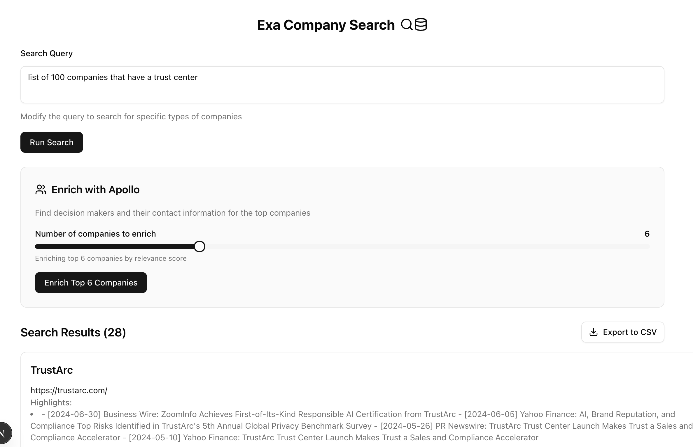

# Exa Company Search



A company search and contact enrichment tool built with [Next.js](http://nextjs.org/), [Exa API](https://exa.ai/), and [Apollo.io](https://www.apollo.io/).

## Overview

Search for companies using natural language queries via the Exa API, then enrich results with decision-maker contacts (CTOs, VPs, Directors) from Apollo. Export everything to CSV for your sales pipeline.

## Features

- **Exa Company Search**: Natural language search for companies (e.g., "companies with trust centers")
- **Apollo Contact Enrichment**: Find decision-makers with verified email addresses
- **CSV Export**: Download search results and contacts for use in your CRM

## Getting Started

### Prerequisites

- Node.js 20+
- pnpm (recommended) or npm
- [Exa API key](https://exa.ai/)
- [Apollo API key](https://www.apollo.io/)

### Installation

1. Clone the repository:

```bash
git clone https://github.com/joshupadhyay/exa-apollo-enrichment.git
cd exa-apollo-enrichment
```

2. Install dependencies:

```bash
pnpm install
```

3. Set up environment variables:

```bash
cp .env.example .env.local
```

Configure the following variables:

```bash
# Exa API Key
EXA_API_KEY=your_exa_api_key

# Apollo API Key
APOLLO_API_KEY=your_apollo_api_key
```

4. Run the development server:

```bash
pnpm dev
```

5. Open [http://localhost:3000](http://localhost:3000) to start searching.

## Project Structure

```text
exa-apollo-enrichment/
├── app/
│   ├── api/
│   │   ├── exa-search/       # Exa search endpoint
│   │   └── apollo-enrich/    # Apollo enrichment endpoint
│   └── page.tsx              # Home page
├── lib/
│   ├── apollo.ts             # Apollo API client
│   └── types.ts              # TypeScript schemas and types
└── components/
    └── exa-search-form.tsx   # Main search form component
```

## Usage

1. Enter a search query (e.g., "list of 100 companies that have a trust center")
2. Click "Run Search" to find companies via Exa
3. Adjust the enrichment slider to select how many companies to enrich
4. Click "Enrich with Apollo" to find contacts
5. Click "Export to CSV" to download results

## License

MIT
